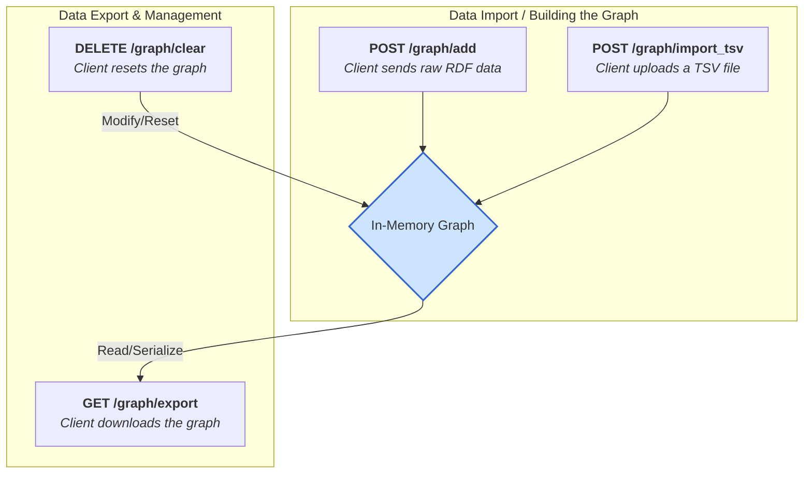

# Concepts

The API can be used to gradually combine metadata on videos to build an in memory graph and then export it.

## Import

The Graph can import arbitrary turtle files, to complement the graph for a video corpus with any metadata that is of value.

- `POST graph/import`: for adding custom turtle metadata to the graph.
- `POST graph/import_tsv`: for adding videoanalysis data to the graph (see for example [TIB-AV-A](tools.md#tib-av-a))

## Export

The graph can be exported as any time. You can always take a look on the current state of the graph. The export saves the graph to a turtle file.

- `GET graph/export`: for adding custom turtle metadata to the graph.

## Clear

The Graph will not be stored longterm, but only live during a MAVA session:

- `DELETE graph/clear`: there is an api route to clear the graph

