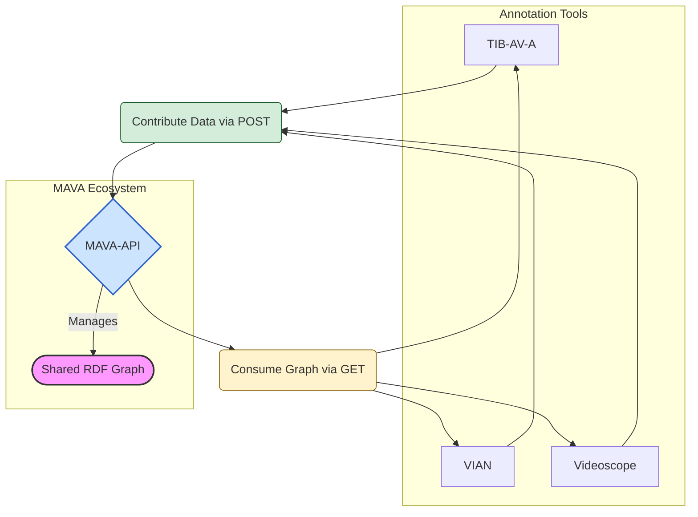

# MAVA Project Documentation

## About

The MAVA Cluster aims to improve the interoperability and data exchange among three research tools – [VideoScope](https://videoscope.linguistik.uzh.ch/), [TIB-AV-A](https://www.tib.eu/en/research-development/project-overview/project-summary/tib-av-a), and [VIAN](https://www.vian.app/). By standardizing data formats and developing shared APIs, the project will enhance data sharing and analysis capabilities across linguistic, media studies, and audiovisual research. This infrastructure will enable shared research workflows and ensure adherence to FAIR principles, enhancing the accessibility and reusability of research data.

The project's integration with the [CLARIN](https://clarin-ch.ch/) infrastructure will align it with European research standards, significantly aiding the research community's ability to handle complex multimodal datasets.

## Goals

- Establish a common terminology for video metadata tool, so that metadata can be exchanged
- Supporrt imports and export of video and corpus metadata for sharing metadata between the [MAVA tools](tools.md)

## Overview

All MAVA tools can contribute to to produce a MAVA graph and they can also consume the graph and import the metadata for a video or video corpus.

## Quicklinks

[MAVA-Ontology](ontology.md){ .md-button }
[MAVA-API](api.md){ .md-button }
[MAVA-Tools](tools.md){ .md-button }
[MAVA-Roadmap](roadmap.md){ .md-button }
