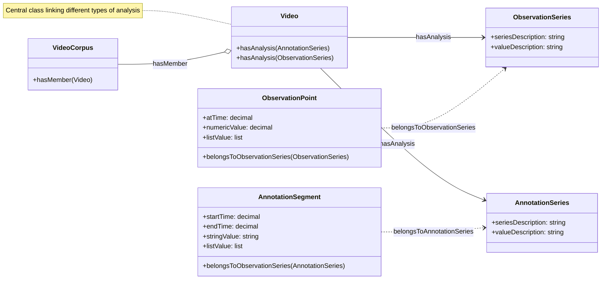
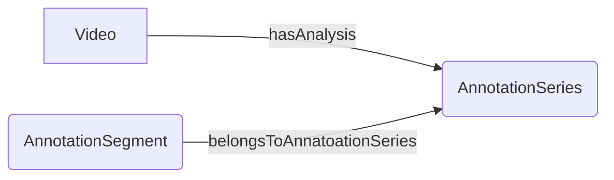
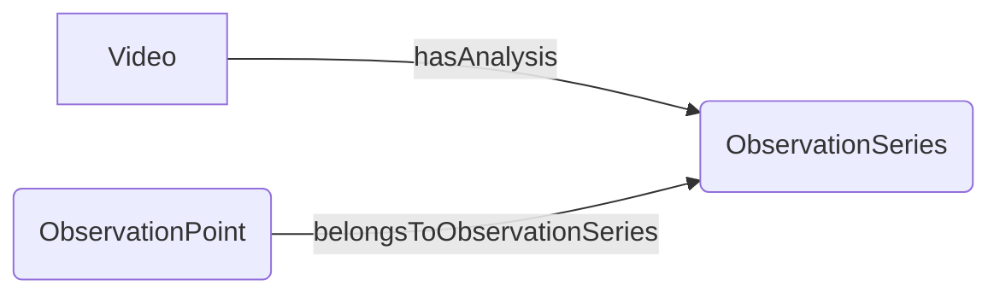

# MAVA Ontology

The MAVA Ontology is just a Draft for now and will be revised later on.

## Guiding Principles

- establish the ontology in owl
. start with the basic vocabulary that the tools need to describe their metadata
. complexity and alingment with existing vocabularies can be acchieved later on

## Pylode Documentation

The ontology is documented with [pylode](https://github.com/RDFLib/pyLODE).

[MAVA-Ontology Documentation](https://sdsc-ordes.github.io/mava-api/ontology/){ .md-button }

## Classes

Below you can see the current class diagram:

- **Video**: links the analyis together (as MAVA connects metadata on videos)
- **ObservationSeries**: analysis with measurements at certain timepoints
- **AnnotationSeries**: annotations that relate to time intervals

## Annotation Series

**Annotation Segment**: represents an annotation relating to a time interval:

- startTime: 10.5s
- endTime: 15.2s
- Annotation: "Sone annotation on the time inteval in the video"

## DataSeries

**Observation Point**: represents an Instant and a Measurement:

- atTime: 1.75s
- numericValue: 0.883
