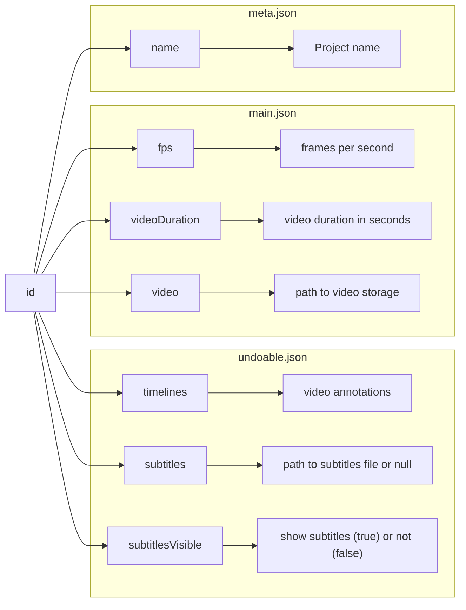
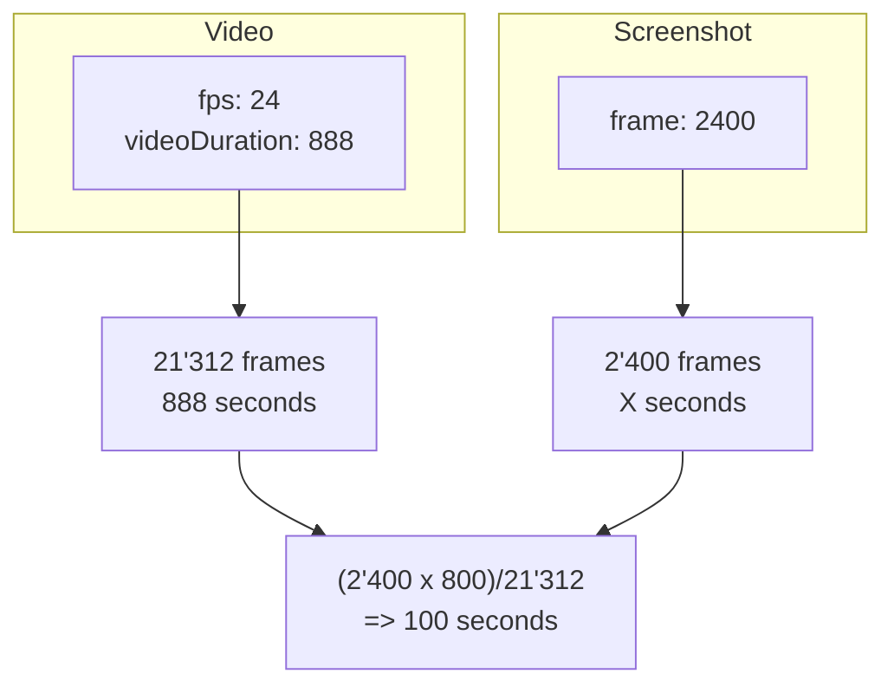

# Tools

MAVA tools so far:

- [TIB-AV-A](#tib-av-a)
- [VIAN](#vian)
- [videoscope](#videoscope)

## TIB-AV A

| Category | Link or Value |
| ----------- | ------------------------------------ |
| Project Page | [TIB AV-Analytics](https://www.tib.eu/en/research-development/project-overview/project-summary/tib-av-a) |
| Demo | [Video and Demo](https://service.tib.eu/tibava/) |
| Code | [tibava](https://github.com/TIBHannover/tibava) |
| Status | stable with heavy new development |

### About

TIB-AV-A analysizes single videos with AI tools, but also allows for manual annotations

### Export

Exports are offered in the following formats:

- individual `tsv`s
- merged `tsv`s
- [ELAN](https://archive.mpi.nl/tla/elan) exports


### TIB-AV-A Export data (TSVs)

One TSV file represents an "annotation band".

- 5 fields for anything with a duration:`start`, `start in seconds`, `duration`, `duration in seconds` and `annotations`
- 3 fields for anything that happens in a specific moment: `start in seconds`, `start hh:mm:ss.ms` and `annotations`

Fields:

`start in seconds`

:   Seconds from start of the video

`start hh:mm:ss.ms`

:   maps `start in seconds` to a human readable format

`duration in seconds`

:   duration in seconds

`duration hh:mm:ss.ms`

:   maps `duration in seconds` to a human readable format

`annotations`

: either `numeric value`(Example: `Angry.tsv`) or `array of numeric values`(Example: `Dominant Color(s).tsv`) or Array of Strings (`Face Emotions.tsv`, `Speech Recognition.tsv`). The string array values usually start with a qualifier: `'Transcript:: Here is the first German television with the daily news.'` or `'Emotion::Neutral'`

Examples:

<details>

<summary>Example of a transcript annotation file with duration (annotation is a string)</summary>

```
start hh:mm:ss.ms   start in seconds	duration hh:mm:ss.ms	duration in seconds	    annotations
00:00:00.0	        0.0	                00:00:14.0	            14.0	                ['Transcript:: Sieh mal was ich gefunden hab.']
00:00:14.0	        14.0	            00:00:03.0	            3.0	                    ['Transcript:: Was ist das?']
00:00:17.0	        17.0	            00:00:07.0	            7.0	                    ['Transcript:: Samenkörner.']
00:00:24.0	        24.0	            00:00:02.0	            2.0	                    ['Transcript:: Wir sind uns so ähnlich wie beide.']
```

</details>

<details>

<summary>Example of an audio average power annotation file with time points (annotation is a number)</summary>

```
start in seconds	start hh:mm:ss.ms	annotations
0.0	                00:00:00.0	        0.05131
0.064	            00:00:00.64	        0.29395
0.128	            00:00:00.128	    0.31521
0.192	            00:00:00.192	    0.46293
0.256	            00:00:00.256	    0.47344
0.32	            00:00:00.320	    0.39055
```

</details>

### Open Questions

???+ question

    Does TIB-AV-A plan to have MAVA imports?


## Videoscope

| Category | Link or Value |
| ----------- | ------------------------------------ |
| Platform | [Videoscope](https://videoscope.linguistik.uzh.ch/) |
| Landing Page | [Videoscope in LiRI](https://www.liri.uzh.ch/en/services/LiRI-Corpus-Platform-LCP/Videoscope.html) |
| Tutorial | [Videoscope Manual](https://lcp.linguistik.uzh.ch/manual/videoscope.html) |
| Code | private code base |
| Context | [LiRI-Corpus-Platform-LCP](https://www.liri.uzh.ch/en/services/LiRI-Corpus-Platform-LCP.html)
| Status | stable with heavy new development |

### About

Videoscope is part of a bigger application that imports linguistic corporas to make them searchable. Next to videoscope, that takes care of video corpora, there is also [soundscript](https://www.liri.uzh.ch/en/services/LiRI-Corpus-Platform-LCP/Soundscript.html) and [catchphrase](https://www.liri.uzh.ch/en/services/LiRI-Corpus-Platform-LCP/Catchphrase.html), taking care of audio collection and text collections.

### Import

- imports need to be done for a corpus of multiple videos all at once
- videoscope might come with additionsl context, that is shared between videos of a corpora

### Videoscope internal data

SRT files:

```
1
00:00:10,433 --> 00:00:14,366
It shouldn't be that complicated to
carry out simple edits in a speech corpus.

2
00:00:14,766 --> 00:00:18,200
And luckily with databaseExplorer
it isn't.
```

Direct parts of the SRT file

- `Document`: SRT File or a part of it (for example when speaker changes it could be a new document)
- `Segment`: an SRT item that has a time intervall
- `Token`: words in the srt file: everything seperated by a blank or punctuation
- `Char`: all characters are counted to provide the position of `Tokens`

Derived parts of the SRT file

- `Form`: is a unique `Token` within the file: so a `Form` can appear more than once: in the example `t` appears two times in `shouldn't` and `ìsn't`.
- `Lemma`: the tutorial says that all corpora need to define a `lemma` attribute, but it is left open what it is: in the tutorial the `form` is just reused as `lemma`. In the examples it is high german where as the form is Swiss German.

There can be other derived attributes besides `lemma`, such as for example `shortended`. `lemma` is just the example of a mapping of tokens to some attribute.

Identification

Globally within videoscope

- `Segments` get a uuid, they are the building blocks of the SRT file

Locally within video

- `document`, `token`, `form`, `lemma` get a `sequence number` within the video, but no uuid: so they are only identified within the scope of the video but not globally. The identifiers are `token_id`, `form_id`, `lemma_id`.

Position measurements

- `char_range` for position within the text of the video: all characters are counted
- `frame_range`: for time position in the video and is also counted as 25 frames per second

Files

```
├── annotation.csv
├── document.csv
├── fts_vector.csv
├── global_attribute_who.csv
├── meta.json
├── segment.csv
├── token.csv
├── token_form.csv
└── token_lemma.csv
```

Video parts ("Layers")

FK=Foreign Key to another table

| File Name        | Identifier(s)                     | Position Columns              | Metadata / Other Columns                                                                                              | Description / Purpose            |
| :--------------- | :-------------------------------- | :---------------------------- | :-------------------------------------------------------------------------------------------------------------------- | :------------------------------- |
| `document.csv`   | `document_id` (assumed) | `char_range`, `frame_range`   | , `name`, `who_id`, `transcriptor`, `tool`, `transcription_phase`, `normalisation`, `media`                                     | Document-level info              |
| `segment.csv`    | `segment_id` (uuid)         | `char_range`, `frame_range`   | `who_id`, `meta` (link/details?)                                                                                      | Segments within documents        |
| `fts_vector.csv` | `segment_id` (FK)                 | (N/A - relates to segment)    | Segment as Vector data                                                                                                           | Full-text search vectors         |
| `token.csv`      | `token_id` (assumed), `segment_id` (FK), `form_id` (FK), `lemma_id` (FK) | `char_range`, `frame_range`   | `xpos`, `unclear`, `truncated`, `vocal`                                          | Tokens within segments           |

Annotations

| File Name                  | Identifier(s)             | Position Columns     | Metadata / Other Columns                  | Description / Purpose                |
| :------------------------- | :------------------------ | :------------------- | :---------------------------------------- | :----------------------------------- |
| `annotations.csv`          | `annotation_id` (assumed) | `char_range` (link)  | `type`, `meta`, (needs clarification) | Annotations on text spans (mostly on `char_range` gaps between tokens)            |

Metadata

| **File Name** | **Identifier(s)** | **Metadata / Other Columns** | **Description / Purpose** |
| :------------------------- | :-------------------- | :------------------------------------------------------ | :-------------------------------------- |
| `global_attribute_who.csv` | `who_id`              | Speaker/Participant Metadata (name, gender, occupation) | Speaker/participant details           |
| `meta.json`                | `doi` in `meta/url` | JSON structure (needs clarification)                  | Corpus-level metadata                   |
| `token_form.csv`           | `form_id`             | `form`                                                  | Unique token forms (surface text)       |
| `token_lemma.csv`          | `lemma_id`            | `lemma`                                                 | Unique token lemmas (base form) clarify |

### Open Questions

???+ question

    Does videoscope plan to offer MAVA exports?

## VIAN

| Category | Link or Value |
| ----------- | ------------------------------------ |
| Outdated Project Page | [VIAN (predecessor)](https://www.vian.app/) |
| VIAN in the digital humanities context | [Methods and Advanced Tools for the Analysis of Film Colors in Digital Humanities](https://dhq.digitalhumanities.org/vol/14/4/000500/000500.html) |
| Status | VIAN is currently refactored and redisigned by the [TIB-AV-A](#tib-av-a) team |
| Code | No code based is currently published |

### About

VIAN is a project to annotate movies manually. It serves to train students in categorizing shots in films.

### VIAN Internal data

VIAN Lite uses JSON as input/output format for both its web and electron app.

There are 3 metadata files used, one for the overview of the project(s) and two specific for a given project.

To accompany the metadata there's also screenshots and thumbnails in JPEG format.

Files

```
├── meta.json
├── main.json
└── undoable.json
```

JSON metadata

1. `meta.json` contains information about the projects (name and ID).

<details>

<summary>Simplified example (in YAML)</summary>

```yaml
projects:
  0:
    name: "video1.mp4"
    id: "c9b3a996-3556-46c4-b451-144146cde671"
  1:
    name: "video2.mp4"
    id: "9ce12517-0ee5-4ada-a0b1-59a8af874965"
  2:
    name: "vian_project.zip"
    id: "9ce12517-0ee5-4ada-a0b1-59a8af874965"
```
</details>


2. `main.json` contains general information on a given video.

<details>

<summary> Simplified example (in YAML)</summary>

`fps` = frames per second

```yaml
fps:	         24
id: 	         "c9b3a996-3556-46c4-b451-144146cde671"
video:	         "app:///home/entrup/Downloads/video1.mp4"
videoDuration:	 888.032
```

</details>

3. `undoable.json` contains information about the annotations done by the user.

<details>

<summary> Simplified example (in YAML) </summary>

```yaml
id:               "c9b3a996-3556-46c4-b451-144146cde671"
subtitles:        null
subtitlesVisible: true
timelines:
    0:
        type: "screenshots"
        name: "Screenshots"
        id:   "f3d05e17-cc24-4c47-b714-e11e38d43339"
        data:
            0:
              frame:      0
              thumbnail:  "app:///home/vian-lite/c9b3a996-3556-46c4-b451-144146cde671/screenshots/00000000_mini.jpg"
              image:      "app:///home/vian-lite/c9b3a996-3556-46c4-b451-144146cde671/screenshots/00000000.jpg"
              id:         "571bccc2-7354-4ed9-b07a-178093b101b5"
            1:
              frame:      2400
              thumbnail:  "app:///home/vian-lite/c9b3a996-3556-46c4-b451-144146cde671/screenshots/00002400_mini.jpg"
              image:      "app:///home/vian-lite/c9b3a996-3556-46c4-b451-144146cde671/screenshots/00002400.jpg"
              id:         "a8cba49f-c88e-477d-ae02-ce4370fb97d7"
    1:
        type: "shots"
        name: "Shots"
        id:   "cf54019d-abf8-4818-97e6-f8c0bfeac1ef"
        data:
            0:
              start:      0
              end:        751
              id:         "9785c66d-747a-48a1-bed0-cca63c501dee"
              annotation: "test"
            1:
              start:      752
              end:        1017
              id:         "c6d5aade-b94c-4f4e-aef9-5e1614bc3203"
    2: {...}
```

</details>

JSON metadata interpretation

The `id` represents a unique identifier for a video and its used as a key across all metadata files. Via the `id`, one can retrieve:

 1. The name of the project the video is in (`meta.json`)
 2. The duration, the frames per second (`fps`) and where the video is stored (`main.json`)
 3. Subtitle presence and various annotations (`undoable.json`)



Metrics: from frames per second to timestamps

The `fps` and `videoDuration` entries (`main.json`) are important to understand how the video annotations (`undoable.json`) are handled internally in VIAN. All the annotations are defined for either a specific frame (`screenshots`) or a frame range (`shots`). To go from an annotation to a timestamp in the video, one has to multiply the `fps` with the `videoDuration` to obtain the total frames in a video. Then, the timestamp can be obtained by using a proportion: if the total video duration has a certain amount of total frames, which video timestamp has X frames?



Metadata overview

| **File Name**              | **Identifier(s)**     | **Metadata / Other Columns** | **Description / Purpose** |
| :------------------------- | :-------------------- | :------------------------------------------------------ | :-------------------------------------- |
| `meta.json`                | `id`              | Name of project(s) | List of projects           |
| `main.json`                | `id`   | FPS, path to the video and video duration              | General video information                  |
| `undoable.json`            | `id`             | Presence of subtitles and annotations (either for a frame or for a shot)                                                 | User annotations       |

### Open Questions

???+ question

    Status and current data of VIAN Light? What are VIANs plans for MAVA?
